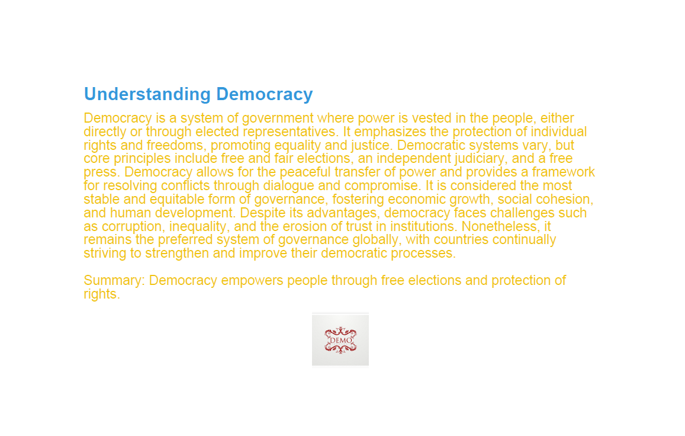

# Multi-Agent PDF Report Generator

This project is a **multi-agent workflow system** that generates content using a Large Language Model (LLM) and produces a PDF report. Each agent in the workflow has a specific role:

- **Content Agent:** Generates the main content based on the user query  
- **PDF Agent:** Creates a PDF with headings, body text, summary, and optional icon  
- **Workflow Agent:** Manages the interaction between agents and ensures smooth execution  

The system demonstrates how multiple agents can collaborate to create structured reports efficiently.

---

## Features

- Content generation based on user query
- Automatic PDF creation with heading, body, summary, and optional icon
- Brand identity support (colors and fonts)
- PDF filenames are randomly generated to avoid overwriting
- Fully modular agent-based architecture
- Built using **LangChain**, **LangGraph**, and **ReportLab**

---

## Prerequisites

- Python 3.11+
- Pip package manager

---

## Installation

1. **Clone the repository:**

```bash
git clone <your-repo-url>
cd <repo-folder>
```

2. **Install dependencies:**

```bash
pip install -r requirements.txt
```

3. **Set environment variables:**

Create a .env file in the project root with:
```bash
GROQ_API_KEY=your_groq_api_key_here
```
Replace your_groq_api_key_here with a valid Grok API key.


## Usage

1. Open Jupyter Notebook or any Python IDE and navigate to the main notebook/script. You can also use jupyter by using the following command.
```bash
jupyter notebook
```
2. Run the workflow cells in order:

- Cell 1: Imports and setup

- Cell 2 & 3: Content and PDF node definitions

- Cell 4: Workflow graph creation

- Cell 5: Execute workflow with your query

- Cell 6: Verify and save PDF with a random unique filename

3. Set your query in Cell 5:
```bash
query = "Democracy"  # Replace with your topic
```
4. Run the notebook. Example console output:
```bash
[System] Executing workflow for query: Democracy
[Content Agent] Generating content for query: Democracy
[Content Agent] Generated content successfully
{'content_generator': {'messages': [HumanMessage(content='Democracy', additional_kwargs={}, response_metadata={}, id='f5185537-f4eb-449b-b508-5bf0589bf7db'), HumanMessage(content='{"title": "Understanding Democracy", "report": "Democracy is a system of government where power is vested in the people, either directly or through elected representatives. It provides a framework for the protection of individual rights and freedoms, promoting equality and justice. Democratic systems often include elements such as free and fair elections, an independent judiciary, and a free press. These components work together to ensure accountability, transparency, and the rule of law. In a democratic society, citizens have the right to participate in the decision-making process, express their opinions, and hold their leaders accountable. The principles of democracy are fundamental to the functioning of modern societies, fostering stability, peace, and economic growth.", "summary": "Democracy empowers people through fair representation and rights", "brand_identity": {"colors": {"primary": "blue", "secondary": "orange"}, "fonts": {"heading": "Arial", "body": "Calibri"}}, "icon_path": "C:\\\\Users\\\\areeb\\\\Desktop\\\\New folder (2)\\\\MultiAgents_Task\\\\icon.png"}', additional_kwargs={}, response_metadata={}, name='content_generator', id='6a149bd7-90b7-4bb4-a1ac-7be00964025c')]}}
----
[PDF Agent] Generating PDF...
[PDF Agent] Error: ValueError("invalid literal for int() with base 10: 'blue'")
{'pdf_generator': {'messages': [HumanMessage(content='Democracy', additional_kwargs={}, response_metadata={}, id='f5185537-f4eb-449b-b508-5bf0589bf7db'), HumanMessage(content='{"title": "Understanding Democracy", "report": "Democracy is a system of government where power is vested in the people, either directly or through elected representatives. It provides a framework for the protection of individual rights and freedoms, promoting equality and justice. Democratic systems often include elements such as free and fair elections, an independent judiciary, and a free press. These components work together to ensure accountability, transparency, and the rule of law. In a democratic society, citizens have the right to participate in the decision-making process, express their opinions, and hold their leaders accountable. The principles of democracy are fundamental to the functioning of modern societies, fostering stability, peace, and economic growth.", "summary": "Democracy empowers people through fair representation and rights", "brand_identity": {"colors": {"primary": "blue", "secondary": "orange"}, "fonts": {"heading": "Arial", "body": "Calibri"}}, "icon_path": "C:\\\\Users\\\\areeb\\\\Desktop\\\\New folder (2)\\\\MultiAgents_Task\\\\icon.png"}', additional_kwargs={}, response_metadata={}, name='content_generator', id='6a149bd7-90b7-4bb4-a1ac-7be00964025c'), HumanMessage(content='PDF node error: ValueError("invalid literal for int() with base 10: \'blue\'")', additional_kwargs={}, response_metadata={}, id='217b74fd-350c-498e-8e41-1c223e474f9a')]}}
----
[System] PDF will be saved as: report_5265.pdf

```

## Output

- PDF contains:
- Title (Heading)
- Report content (Body)
- Summary (Body)
- Optional icon if available
- Example filename: report_4352.pdf


Notes

Brand identity fonts in PDFs must be installed on the system to avoid errors. Default fonts (Helvetica) are always safe.

PDF filenames use a random number (0–15000) to avoid overwriting previous reports.

LLM responses are generated using Grok API with LangChain.

### Troubleshooting

Missing API Key Error: Ensure .env file exists with a valid GROQ_API_KEY.

### Font Mapping Error: 
Use default fonts in DEFAULT_BRAND_IDENTITY if custom fonts are not installed.

### PDF Overwrite: 
The name of the generated pdf file would be based on the current time and would be saved in the same folder.




## Acknowledgment

This project and its documentation were created with the assistance of AI, specifically using Large Language Models for content generation and workflow design.